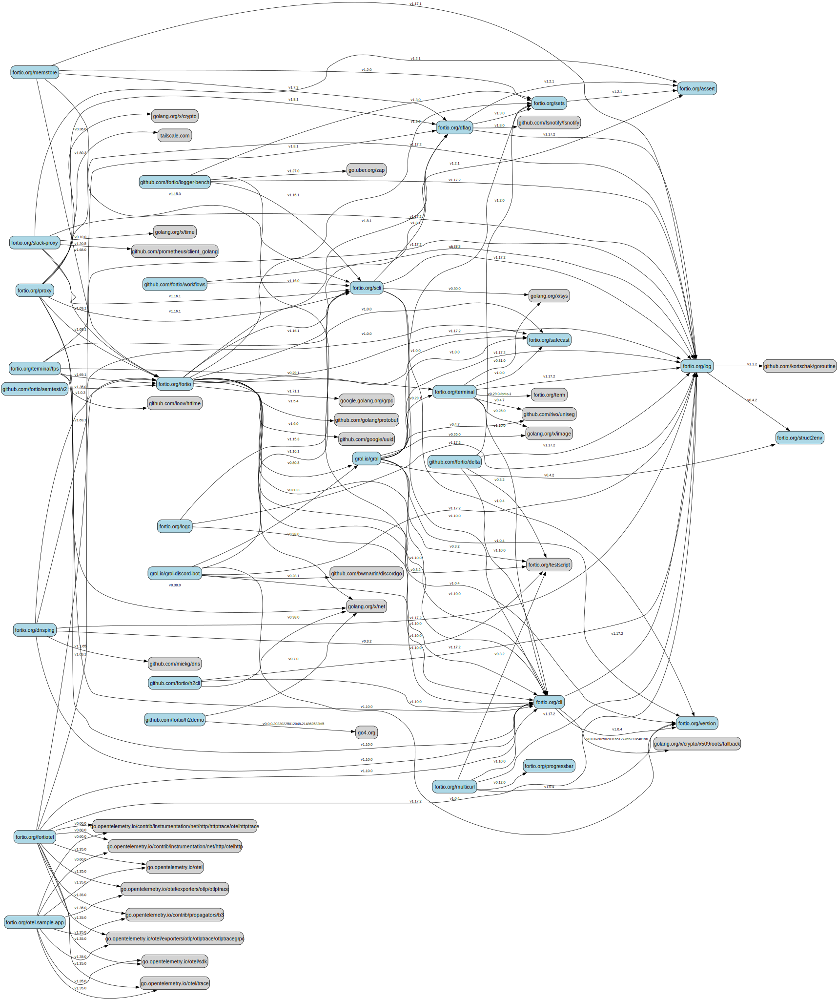

# Go Module Dependency Graph Generator (`depgraph`)

This tool scans specified GitHub organizations or user accounts for public Go modules, parses their direct dependencies from `go.mod` files, and generates a dependency graph in DOT format. The DOT file can then be visualized using tools like Graphviz.

## Features

* Scans multiple GitHub organizations and/or user accounts.
* Identifies public, non-fork, non-archived repositories containing a `go.mod` file at the root. Also processes forks found within those accounts.
* Uses the GitHub API to fetch repository information and `go.mod` contents (with optional filesystem caching).
* Parses direct dependencies (module path and required version) from `go.mod` files using `golang.org/x/mod/modfile`.
* Generates a graph in DOT format suitable for visualization tools.
* Distinguishes between internal modules (non-forks, included forks) and external dependencies using node colors.
* Provides options to exclude external dependencies and manage the API cache.
* Logs progress and warnings to stderr, keeping stdout clean for DOT output.

## Prerequisites

* **Go:** Version 1.18 or later. Needed to install and run the tool.
* **`gh` CLI:** The official GitHub CLI, used for authentication (getting a token). Install it from [cli.github.com](https://cli.github.com/). Required for the tool to access the GitHub API.
* **Graphviz (Optional):** Needed only if you want to convert the DOT output into an image (e.g., `png`, `svg`). Install it from [graphviz.org](https://graphviz.org/download/).

## Installation (Recommended)

Ensure you have Go installed and configured correctly (including `$GOPATH/bin` or `$HOME/go/bin` in your `PATH`). Then, run:

```bash
go install github.com/ldemailly/depgraph@latest
```

This will download the source code, compile it, and place the `depgraph` executable in your Go binary directory.

## Usage

1.  **Authenticate with GitHub:**
    The tool needs a GitHub token to interact with the API and avoid rate limits. Use the `gh` CLI to provide one via an environment variable:
    ```bash
    export GITHUB_TOKEN=$(gh auth token)
    ```
    *(Ensure you have run `gh auth login` previously)*

2.  **Run the tool:**
    Execute the `depgraph` command, optionally providing flags, followed by the names of the GitHub organizations or user accounts you want to scan. Redirect the standard output (`stdout`) to a `.dot` file. Progress and errors are printed to `stderr`.
    ```bash
    depgraph [flags] <owner1> [owner2]... > dependencies.dot
    ```
    *Example:*
    ```bash
    depgraph -noext -clear-cache fortio grol-io ldemailly > dependencies.dot
    ```

3.  **Visualize the Graph (using Graphviz):**
    Use the `dot` command (from Graphviz) to convert the generated `dependencies.dot` file into an image format like PNG or SVG.
    * **Generate PNG:**
        ```bash
        dot -Tpng dependencies.dot -o dependencies.png
        ```
    * **Generate SVG:**
        ```bash
        dot -Tsvg dependencies.dot -o dependencies.svg
        ```
    You can then open the generated image file.

### Command-Line Flags

* `-noext`: (Boolean, default `false`) If set, excludes external dependencies (modules not found in the specified owners) from the graph.
* `-use-cache`: (Boolean, default `true`) Enables the use of a local filesystem cache for GitHub API calls to speed up subsequent runs. Cache is stored in the user's cache directory (e.g., `~/.cache/depgraph_cache`). Disable with `-use-cache=false`.
* `-clear-cache`: (Boolean, default `false`) If set, removes the cache directory before running. Useful if you suspect the cache is stale.

## Example

Example graph generated by running the tool with my `fortio`, `grol-io`, and `ldemailly` accounts:



## Graph Legend

* **Nodes:** Represent Go modules.
* **Edges:** Represent direct dependencies (from `require` directives in `go.mod`). The label shows the required version.

### Node Colors

Node colors indicate the origin and type of the module:

* **Light Blue / Light Green / Light Salmon / ...:** A non-fork module whose `go.mod` was found in the 1st / 2nd / 3rd / ... owner (org or user) specified on the command line. The colors cycle through a predefined palette.
* **Dark Blue / Dark Green / Dark Orange / ...:** A fork module whose `go.mod` was found in the 1st / 2nd / 3rd / ... owner. Forks are included in the graph only if:
    1.  They are depended upon by an included non-fork module, **OR**
    2.  They themselves depend on an included non-fork module.
* **Light Grey:** An external module (a dependency whose defining `go.mod` was not found in any of the specified owners). These nodes are hidden if the `-noext` flag is used.

### Node Labels

* **Non-Fork / External:** Labeled with the Go module path declared in `go.mod` (e.g., `fortio.org/log`, `golang.org/x/net`).
* **Included Fork:** Labeled primarily with the repository path where the fork was found (e.g., `fortio/term`). If the module path declared inside the fork's `go.mod` differs from the module path declared in the original (parent) repository's `go.mod`, the fork's declared module path is added on a second line, like: `fortio/term\n(module: term.fortio.org)`

## Development Setup (Building from Source)

If you want to modify the code or contribute:

1.  **Clone the repository:**
    ```bash
    git clone https://github.com/ldemailly/depgraph.git
    cd depgraph
    ```

2.  **Build/Run:**
    ```bash
    # Run directly (uses the module context)
    go run . <owner1> [owner2]... > dependencies.dot

    # Or build the binary
    go build
    ./depgraph <owner1> [owner2]... > dependencies.dot
    ```

## How it Works

1.  **Initialization:** Parses flags, sets up GitHub client, initializes cache system.
2.  **Repository Listing:** For each specified owner (org or user), lists public repositories using the appropriate GitHub API (trying org first, then user on 404). Uses caching if enabled.
3.  **Filtering & `go.mod` Fetching:** For each non-archived repository (including forks), attempts to fetch the content of the `go.mod` file using the GitHub API (with caching).
4.  **Parent `go.mod` Fetching (Forks):** If a repository is a fork, attempts to fetch the `go.mod` from the parent repository to get the original module path (used for labeling). This call is also cached.
5.  **Parsing:** Parses the fetched `go.mod` files to extract the module path and direct dependencies. Stores module info (path, repo path, fork status, original path, owner, dependencies).
6.  **Node Inclusion Logic:** Determines the final set of nodes to include in the graph:
    * Includes all non-fork modules found.
    * Includes fork modules if they depend on an included non-fork OR if they are depended upon by an included non-fork.
    * If `-noext` is false, includes external modules that are dependencies of included nodes.
7.  **DOT Generation:**
    * Iterates through the included nodes, assigning colors and labels based on whether the module is a non-fork, a qualifying fork, or external. Fork labels show repo path and potentially the divergent module path.
    * Iterates through the included source nodes and prints edges to their included dependencies, labeling edges with the required version.

## Future Ideas

* Option to include indirect dependencies (would likely require running `go list -m all`).
* More sophisticated internal module detection (e.g., handling vanity URLs better).
* Alternative graph output formats (JSON, GML).
* Interactive web-based visualizations (e.g., using D3.js, vis.js).
* Handle repositories with multiple Go modules.
