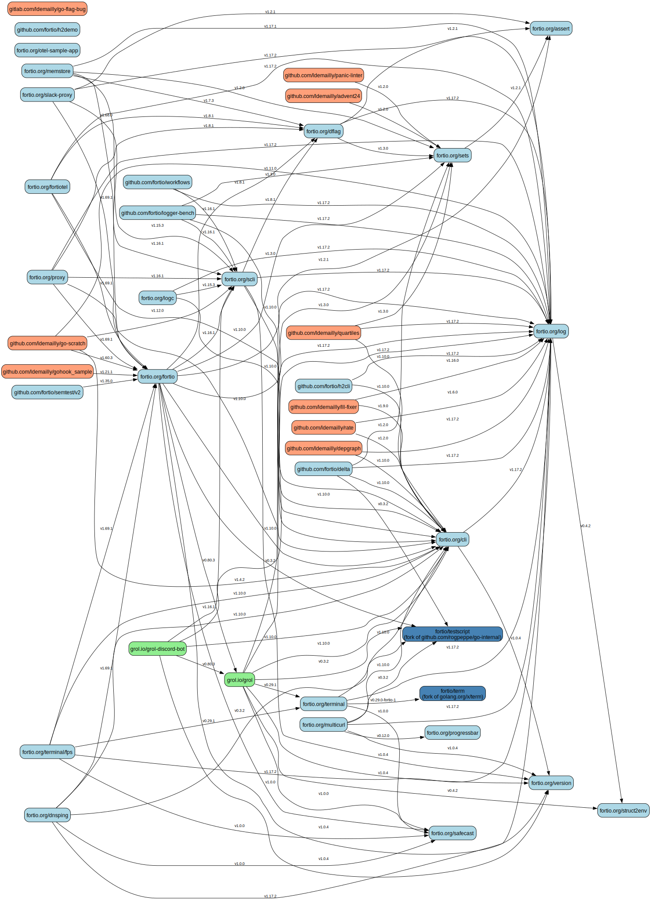

# Go Module Dependency Graph Generator (`depgraph`)

This tool scans specified GitHub organizations or user accounts for public Go modules, parses their direct dependencies from `go.mod` files, and generates a dependency graph in DOT format. The DOT file can then be visualized using tools like Graphviz.

## Features

* Scans multiple GitHub organizations and/or user accounts.
* Identifies public, non-fork, non-archived repositories containing a `go.mod` file at the root. Also processes forks found within those accounts.
* Uses the GitHub API to fetch repository information and `go.mod` contents (with optional filesystem caching).
* Parses direct dependencies (module path and required version) from `go.mod` files using `golang.org/x/mod/modfile`.
* Generates a graph in DOT format suitable for visualization tools.
* Distinguishes between internal modules (non-forks, included forks) and external dependencies using node colors.
* Provides options to exclude external dependencies and manage the API cache.
* Logs progress and warnings to stderr, keeping stdout clean for DOT output.

## Prerequisites

* **Go:** Version 1.18 or later. Needed to install and run the tool.
* **`gh` CLI:** The official GitHub CLI, used for authentication (getting a token). Install it from [cli.github.com](https://cli.github.com/). Required for the tool to access the GitHub API.
* **Graphviz (Optional):** Needed only if you want to convert the DOT output into an image (e.g., `png`, `svg`). Install it from [graphviz.org](https://graphviz.org/download/).

## Installation (Recommended)

Ensure you have Go installed and configured correctly (including `$GOPATH/bin` or `$HOME/go/bin` in your `PATH`). Then, run:

```bash
go install github.com/ldemailly/depgraph@latest
```

This will download the source code, compile it, and place the `depgraph` executable in your Go binary directory.

## Usage

1.  **Authenticate with GitHub:**
    The tool needs a GitHub token to interact with the API and avoid rate limits. Use the `gh` CLI to provide one via an environment variable:
    ```bash
    export GITHUB_TOKEN=$(gh auth token)
    ```
    *(Ensure you have run `gh auth login` previously)*

2.  **Run the tool:**
    Execute the `depgraph` command, optionally providing flags, followed by the names of the GitHub organizations or user accounts you want to scan. Redirect the standard output (`stdout`) to a `.dot` file. Progress and errors are printed to `stderr`.
    ```bash
    depgraph [flags] <owner1> [owner2]... > dependencies.dot
    ```
    *Example:*
    ```bash
    depgraph -noext -clear-cache fortio grol-io ldemailly > dependencies.dot
    ```

3.  **Visualize the Graph (using Graphviz):**
    Use the `dot` command (from Graphviz) to convert the generated `dependencies.dot` file into an image format like PNG or SVG.
    * **Generate PNG:**
        ```bash
        dot -Tpng dependencies.dot -o dependencies.png
        ```
    * **Generate SVG:**
        ```bash
        dot -Tsvg dependencies.dot -o dependencies.svg
        ```
    You can then open the generated image file.

### Command-Line Flags

* `-noext`: (Boolean, default `false`) If set, excludes external dependencies (modules not found in the specified owners) from the graph/output.
* `-left2right`: (Boolean, default `false`) If set, generates the DOT graph with a left-to-right layout (`rankdir=LR`) instead of the default top-to-bottom layout (`rankdir=TB`).
* `-topo-sort`: (Boolean, default `false`) If set, outputs the dependency order as text grouped by topological sort levels (leaves first) to standard output, instead of generating DOT graph output.
* `-use-cache`: (Boolean, default `true`) Enables the use of a local filesystem cache for GitHub API calls to speed up subsequent runs. Cache is stored in the user's cache directory (e.g., `~/.cache/depgraph_cache`). Disable with `-use-cache=false`.
* `-clear-cache`: (Boolean, default `false`) If set, removes the cache directory before running. Useful if you suspect the cache is stale.

## Example

Example graph generated by running the tool with my `fortio`, `grol-io`, and `ldemailly` accounts:
```bash
depgraph  -left2right -noext fortio grol-io ldemailly > dependencies.dot
dot -Tsvg dependencies.dot -o dependencies.svg; open dependencies.svg
```



There is a new `-topo-sort` that indicates in which order can modules be updated in order to only have to do a single pass and which can be do in parallel (indicated by being at the same level) - that was the main goal for this project (next up drive dependabot from that and autorelease/tag maybe)

```bash
depgraph -noext -topo-sort fortio grol-io ldemailly
```
Outputs
```
Topological Sort Levels (Leaves First):
Level 0:
  - fortio.org/assert
  - fortio.org/otel-sample-app
  - fortio.org/progressbar
  - fortio.org/safecast
  - fortio.org/struct2env
  - fortio/term (fork of golang.org/x/term)
  - fortio/testscript (fork of github.com/rogpeppe/go-internal)
  - fortio.org/version
  - ldemailly/discordgo (fork of github.com/bwmarrin/discordgo)
  - github.com/fortio/h2demo
  - ldemailly/dns (fork of github.com/miekg/dns)
  - ldemailly/gohook (fork of github.com/robotn/gohook)
  - gitlab.com/ldemailly/go-flag-bug
  - ldemailly/zap (fork of go.uber.org/zap)
  - ldemailly/term (fork of golang.org/x/term)
  Level 1:
    - fortio.org/log
    - fortio.org/sets
    Level 2:
      - fortio.org/cli
      - fortio.org/dflag
      - github.com/ldemailly/advent24
      - github.com/ldemailly/panic-linter
      Level 3:
        - fortio.org/multicurl
        - fortio.org/scli
        - fortio.org/terminal
        - github.com/fortio/delta
        - github.com/fortio/h2cli
        - github.com/ldemailly/depgraph
        - github.com/ldemailly/lll-fixer
        - github.com/ldemailly/quartiles
        - github.com/ldemailly/rate
        Level 4:
          - fortio.org/logc
          - github.com/fortio/logger-bench
          - github.com/fortio/workflows
          - grol.io/grol
          Level 5:
            - fortio.org/fortio
            - grol.io/grol-discord-bot
            - grol-io/scriggo-bench (fork of scriggo-bench)
            Level 6:
              - fortio.org/dnsping
              - fortio.org/fortiotel
              - fortio.org/memstore
              - fortio.org/proxy
              - fortio.org/slack-proxy
              - fortio.org/terminal/fps
              - github.com/fortio/semtest/v2
              - github.com/ldemailly/go-scratch
              - github.com/ldemailly/gohook_sample
```

## Graph Legend

* **Nodes:** Represent Go modules.
* **Edges:** Represent direct dependencies (from `require` directives in `go.mod`). The label shows the required version.

### Node Colors

Node colors indicate the origin and type of the module:

* **Light Blue / Light Green / Light Salmon / ...:** A non-fork module whose `go.mod` was found in the 1st / 2nd / 3rd / ... owner (org or user) specified on the command line. The colors cycle through a predefined palette.
* **Dark Blue / Dark Green / Dark Orange / ...:** A fork module whose `go.mod` was found in the 1st / 2nd / 3rd / ... owner. Forks are included in the graph only if:
    1.  They are depended upon by an included non-fork module, **OR**
    2.  They themselves depend on an included non-fork module.
* **Light Grey:** An external module (a dependency whose defining `go.mod` was not found in any of the specified owners). These nodes are hidden if the `-noext` flag is used.

### Node Labels

* **Non-Fork / External:** Labeled with the Go module path declared in `go.mod` (e.g., `fortio.org/log`, `golang.org/x/net`).
* **Included Fork:** Labeled primarily with the repository path where the fork was found (e.g., `fortio/term`). If the module path declared inside the fork's `go.mod` differs from the module path declared in the original (parent) repository's `go.mod`, the fork's declared module path is added on a second line, like: `fortio/term\n(module: term.fortio.org)`

## Development Setup (Building from Source)

If you want to modify the code or contribute:

1.  **Clone the repository:**
    ```bash
    git clone https://github.com/ldemailly/depgraph.git
    cd depgraph
    ```

2.  **Build/Run:**
    ```bash
    # Run directly (uses the module context)
    go run . <owner1> [owner2]... > dependencies.dot

    # Or build the binary
    go build
    ./depgraph <owner1> [owner2]... > dependencies.dot
    ```

## How it Works

1.  **Initialization:** Parses flags (`-noext`, `-use-cache`, `-clear-cache`, `-topo-sort`), sets up GitHub client, initializes or clears the cache system based on flags.
2.  **Repository Listing:** For each specified owner (org or user), lists public repositories using the appropriate GitHub API (trying org first, then user on 404). Uses caching if enabled.
3.  **Filtering & `go.mod` Fetching:** For each non-archived repository (including forks), attempts to fetch the content of the `go.mod` file using the GitHub API (with caching).
4.  **Parent `go.mod` Fetching (Forks):** If a repository is a fork, attempts to fetch the full repository details (cached) to get the parent repository info. Then attempts to fetch the `go.mod` from the parent repository to get the original module path (used for labeling). This call is also cached.
5.  **Parsing:** Parses the fetched `go.mod` files to extract the module path and direct dependencies. Stores module info (path, repo path, fork status, original path, owner, dependencies).
6.  **Node Inclusion Logic:** Determines the final set of nodes (`nodesToGraph`) to include based on fetched data and the `-noext` flag. Includes non-forks, qualifying forks (referenced by or depending on non-forks), and optionally external dependencies.
7.  **Output Generation:**
    * If `-topo-sort` is **true**: Performs a topological sort (Kahn's algorithm on the reversed dependency graph of included nodes) to determine update levels (leaves first). Prints the levels and nodes (custom formatting for forks) to standard output. Warns on standard error if cycles are detected.
    * If `-topo-sort` is **false** (default): Generates the dependency graph in DOT format and prints it to standard output. Assigns node colors (based on owner index and fork status) and labels (custom formatting for forks). Edges are labeled with versions.

## Future Ideas

* Option to include indirect dependencies (would likely require running `go list -m all`).
* More sophisticated internal module detection (e.g., handling vanity URLs better).
* Alternative graph output formats (JSON, GML).
* Interactive web-based visualizations (e.g., using D3.js, vis.js).
* Handle repositories with multiple Go modules.

## About this

All the code in 0.1.0 is generated through many iterations/prompts of Gemini 2.5 pro

The driving and idea and need and "QA"ing is my own (ldemailly) but I haven't (yet) reviewed the code outside of pointing out errors etc

For code quality and structure see my other repos (in fortio/)

